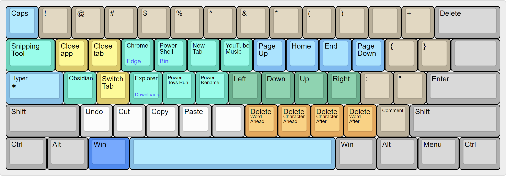

# Capslock Enhancement
> Make CapsLock Great As It Should!!!

This project will transform the CapsLock key into a Hyper(✱) that can improve work and personal productivity. 
As someone who switches between Windows and MacOS, one thing annoyed me: the keyboard layout. 
This project will create a configuration that I can have almost identical experiences using MacOS and Windows, regardless of whether I use my small mechanical keyboard or the built-in keyboard on Macbook. 
# Highlights
- Transform Capslock into a powerful Hyper(✱)
- Quickly launch apps, useful navigation, window control, shortcuts, etc.
- Speed up productivity, high-frequency move stay in the home row.
- Work with existing modifiers: Ctrl, Win, Alt still work with other applications as normal
- Same finger position as Mac

# Requirements
- A mechanical keyboard is needed for this project
- AutoHotKey V2 (Windows Only) 
- Reprogrammed Default Layout (ANSI):
To keep the finger position the same when using MacOS or Windows, the `Alt` and `Win` keys are swapped to replicate the `Opt` and `Cmd` keys on Mac, which I find more ergonomic when typing. For this matter, you will need a programmable keyboard to remap the keys. 
The rest of the keyboard will be the default ANSI layout.

# The CapsLock-Hyper Layout
For macOS, please visit [Vonng/capslock](https://github.com/Vonng/Capslock) who has done excellent work for both MacOS and Windows (limited to AutoHotkey V1). 
This project will focus on Windows for now with the new updated AutoHotkey V2 released in 2023.

Below is the projected keyboard layout with Hyper(✱) (still updating)

# Installation
- Install [AutoHotkey V2](https://www.autohotkey.com/)
- Download the `capslock.ahk` to your Windows PC
- Double-click to run it
- Adjust the script to your own preference. 
